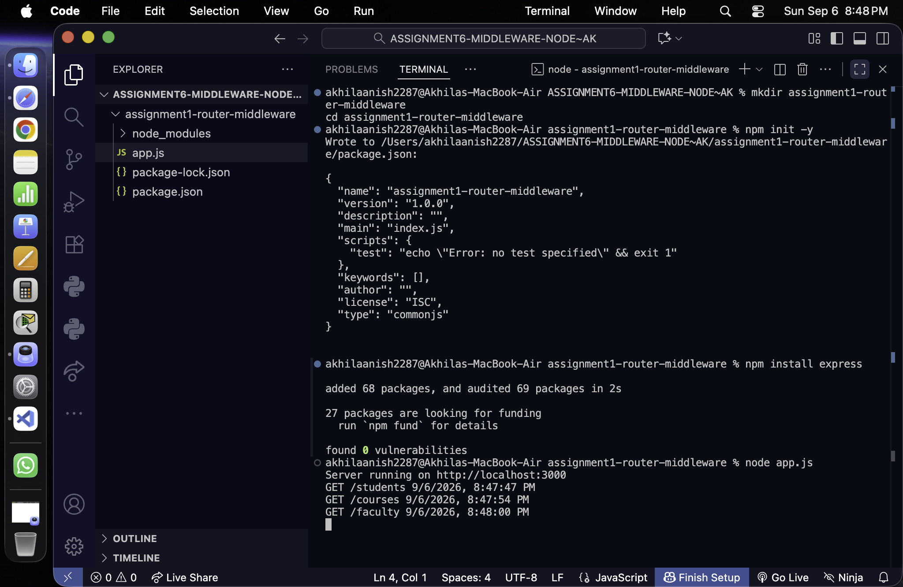
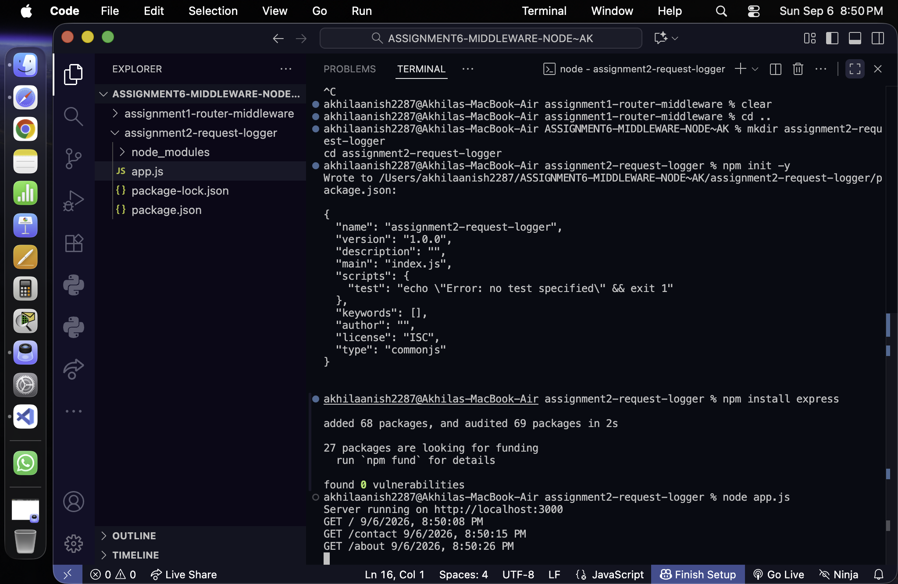
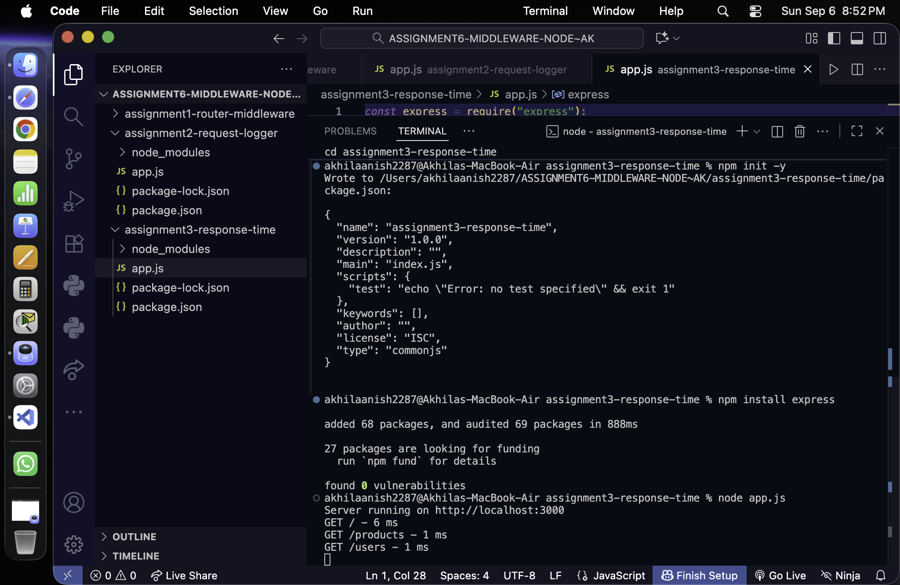

# Express.js Middleware Assignments


## Technologies Used

- Node.js
- Express.js
- JavaScript

---

## Assignment 1 — Router-Level Middleware

### Objective

Implement router-level middleware using Express Router.

### Features

- Created a separate router using Express Router.
- Created a custom router-level middleware named `routerLogger`.
- Logs the HTTP Method, Request URL, and Current Date & Time.
- Created the following routes:
  - `/students`
  - `/courses`
  - `/faculty`
- Mounted the router using `/api`.

### Routes

```text
GET /api/students
GET /api/courses
GET /api/faculty
````

### Browser Output

```text
Students List
Courses List
Faculty List
```

### Terminal Output

```text
GET /students [Date & Time]
GET /courses [Date & Time]
GET /faculty [Date & Time]
```

### Screenshot



---

## Assignment 2 — Request Logger Middleware

### Objective

Create a custom middleware that logs every incoming request.

### Features

* Created a custom middleware named `logger`.
* Logs the HTTP Method, Request URL, and Current Date & Time.
* Middleware executes before every route.
* Created the following routes:

  * `/`
  * `/about`
  * `/contact`

### Routes

```text
GET /
GET /about
GET /contact
```

### Browser Output

```text
Welcome to Home Page
About Us
Contact Information
```

### Terminal Output

```text
GET / [Date & Time]
GET /about [Date & Time]
GET /contact [Date & Time]
```

### Screenshot



---

## Assignment 3 — Response Time Middleware

### Objective

Measure the time taken to process each request using middleware.

### Features

* Created a middleware named `responseTimeLogger`.
* Records the request start time.
* Calculates the total response time.
* Displays the HTTP Method, Request URL, and Response Time in milliseconds.
* Created the following routes:

  * `/`
  * `/products`
  * `/users`

### Routes

```text
GET /
GET /products
GET /users
```

### Browser Output

```text
Home Page
Product List
User List
```

### Terminal Output

```text
GET / - 6 ms
GET /products - 1 ms
GET /users - 1 ms
```

The response time may vary depending on the system.

### Screenshot



---

## Concepts Covered

* Express Router
* Router-Level Middleware
* Global Middleware
* `router.use()`
* `app.use()`
* `req.method`
* `req.url`
* `next()`
* `Date.now()`
* Request Lifecycle
* Response Time Measurement

---

## How to Run

### Assignment 1

```bash
cd assignment1-router-middleware
npm install
node app.js
```

Open in the browser:

```text
http://localhost:3000/api/students
http://localhost:3000/api/courses
http://localhost:3000/api/faculty
```

### Assignment 2

```bash
cd assignment2-request-logger
npm install
node app.js
```

Open in the browser:

```text
http://localhost:3000/
http://localhost:3000/about
http://localhost:3000/contact
```

### Assignment 3

```bash
cd assignment3-response-time
npm install
node app.js
```

Open in the browser:

```text
http://localhost:3000/
http://localhost:3000/products
http://localhost:3000/users
```

---

## Project Structure

```text
ASSIGNMENT6-MIDDLEWARE-NODE~AK/
│
├── assignment1-router-middleware/
│   ├── node_modules/
│   ├── app.js
│   ├── package.json
│   └── package-lock.json
│
├── assignment2-request-logger/
│   ├── node_modules/
│   ├── app.js
│   ├── package.json
│   └── package-lock.json
│
├── assignment3-response-time/
│   ├── node_modules/
│   ├── app.js
│   ├── package.json
│   └── package-lock.json
│
├── SCREENSHOTSZZ/
│   ├── assignment1.png
│   ├── assignment2.png
│   └── assignment3.png
│
└── README.md
```

---

## Conclusion

These assignments demonstrate the use of Express.js middleware for router-level logging, request logging, and response time measurement.

The applications were implemented using Node.js and Express.js and tested through the terminal and browser.

---

**Name:** Akhila Anish Das <br>
**Roll No:** 150096725016

